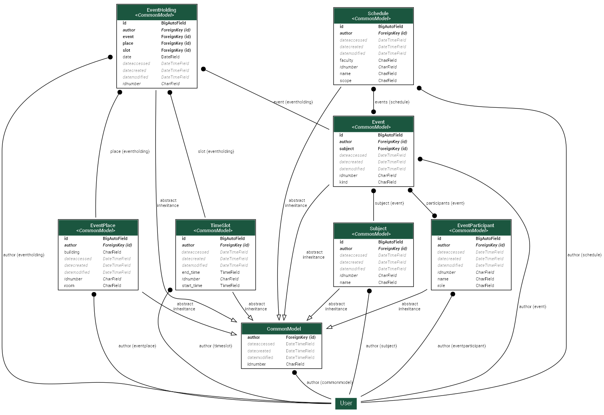

# API Расписаний ВолгГТУ

Часть проекта по разбору расписаний ВолгГТУ.  
Проект представляет собой веб-сервис, предоставляющий API для взаимодействия с расписаниями.

Проект написан с использованием Django и Django REST Framework.


### Инструкция для запуска Django-проекта

1. Склонируйте репозиторий:
```bash
git clone https://github.com/brookite/VSTU_ScheduleAPI.git
```

2. Перейдите в терминале в папку с репозиторием и по желанию создайте [виртуальное окружение](https://docs.python.org/3/library/venv.html). 

3. Выполните команды:

Установить зависимости (однократно):
```bash
python -m pip install -r requirements.txt
```

Создать (или обновить структуру) БД (требуется запускать в начале и после добавления миграций):
```bash
python manage.py migrate

```

Запустить сервер:
```bash
python manage.py runserver
```

4. Чтобы создать аккаунт администратора, используйте команду `python manage.py createsuperuser`

5. Базу данных можно заполнить тестовыми примерами, которые хранятся в папке `testdata`
Команда:

```bash
python manage.py load_testdata
```

Эти тестовые данные не должны быть огромными, см. [комментарий в скрипте-заполнителе](api/management/commands/load_testdata.py)

## ERD диаграмма



## Помощь и FAQ

1. Если необходимо отключить Browsable API (интерфейс API с браузера), удалите строчку, указанную ниже, в [файле](vstu_schedule/settings.py)
```python
REST_FRAMEWORK = {
    "DEFAULT_RENDERER_CLASSES": (
        "api.handlers.ResponseJSONRenderer",
        "rest_framework.renderers.BrowsableAPIRenderer", # удалите эту строчку
    ),
    "EXCEPTION_HANDLER": "api.handlers.exception_response_handler",
}
```